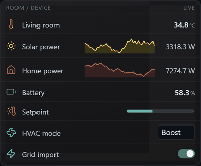

# HexaOS List — dynamic data table



The first HexaOS dashboard widget for the **array** data source. Bind any number of
datapoints into the single array input and the widget draws one row per datapoint:

```
[icon]  Name ...............  value | control | sparkline
```

Each row's value column can be a read-out, a **live control** for a writable point,
or a **rolling sparkline**. Ideal for a sensor list, a room overview, an energy
summary, a controls panel — anywhere you want several live values stacked cleanly.

## Data (Bindings)

The widget has one input, **Datapoints** (`kind:'array'`). Open **Bindings** and
**Add datapoint** for each value you want listed. Each entry is a full row editor:

| Field | What it does |
|-------|--------------|
| Row label | Display name (blank = the datapoint's live label) |
| Icon | The row icon, from the HexaOS icon picker (blank = no icon) |
| Colour | Tints the row icon (blank = the global default icon colour) |
| Unit | Unit override (blank = the datapoint's own unit) |
| Mode | **Value** · **Control** · **Sparkline** — what the value column shows |
| Control | When mode = Control: Auto-detect / Icon toggle / Switch / Button / Number / Stepper / Slider / Dropdown / Text |
| Warn ≥ · Critical ≥ | (Value mode) thresholds that recolour the value / icon |
| Sparkline min / max | (Sparkline mode) per-row range override (blank = global / auto) |
| Write value | (Button control) the value the button writes (blank = toggle 0/1) |
| ↑ / ↓ · ✕ | Reorder / remove the row |

Use **Add datapoint** for value rows and **Add section** for a heading that groups the
rows below it. Add, remove and reorder freely — the list is dynamic and saved with the
dashboard.

### Modes

- **Value** — the formatted value + unit (numeric by the decimals option; non-numeric
  states like `Closed` / `Auto` shown as-is).
- **Control** — turns a **writable** datapoint into a live control. *Auto-detect* picks
  the element from the point: bool → switch, enum → dropdown, numeric → slider (with
  min/max) or number, otherwise a text field. Or pick the element explicitly. Changes
  are written straight to the device, and each control mirrors the live value.
  An **Icon toggle** shows a clickable icon that flips between two user-defined status
  colours (on / off) — set the icon and both colours per row.
- **Sparkline** — a rolling mini-graph (line or bars) of the datapoint with a live read-out
  that uses the Value size / weight / colour. Samples held, min / max (auto, or per-row) and
  the colour / fill are options.
- **Section header** — a non-datapoint row that labels and groups the rows below it.

## Appearance & format (options)

Everything is explicit — there are **no auto or random icons or colours**.

- **Rows**: density (comfortable / compact), dividers, zebra, offline rows (show / dim / hide),
  click-row-to-toggle for switch / icon / button rows.
- **Icon**: icon size, default icon colour (for rows without a per-row colour).
- **Name**: name size, **weight**, colour.
- **Value**: value size, weight, colour, alignment (left / right), min column width.
- **Thresholds**: colour target (value / icon / both), warn colour, critical colour.
- **Format**: decimals (blank = automatic), show unit, tint value with the row colour,
  show last-updated age + its colour.
- **Sparkline**: points held, min, max (auto), colour, style (line / bars), fill-under-line.
- **Summary**: a footer row with sum / average / min / max / count of the numeric Value rows.
- **Header**: optional header row with custom Name / Value headings.

Sizes are absolute px, so the table stays readable and shows more rows as it grows
taller (scroll). Stale or offline rows dim automatically.
