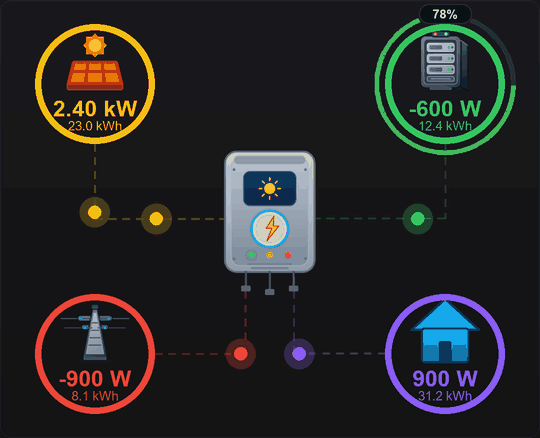

# Power Flow — Dashboard Widget

An animated energy power-flow diagram for the HexaOS WebUI dashboard, inspired by
the Home Assistant *power-flow-card-plus*. A **central inverter** sits in the middle
with four nodes around it — **Solar** (top-left), **Battery** (top-right), **Grid**
(bottom-left), **Home** (bottom-right). Each node is joined to the inverter by a line
that carries a stream of glowing balls; the balls' **direction, speed and count
follow that node's main value** (sign = direction, magnitude = speed/count). The
battery node carries a **state-of-charge arc**.

## Binding (multi-point)
Each node binds its own datapoints (picked from the config form's `point` options):

| Node    | Main value (signed power)                         | Secondary | SOC |
|---------|---------------------------------------------------|-----------|-----|
| Solar   | production (flows to the inverter)                | optional  | —   |
| Grid    | **+ import** (grid → inverter) / **− export**     | optional  | —   |
| Battery | **+ discharge** (battery → inverter) / **− charge** | optional | optional % |
| Home    | consumption (inverter → home)                     | optional  | —   |

- **Main value** — drives the value readout *and* the flow balls. Its **input unit**
  is a dropdown (**W** or **kW**) telling the widget what HxLive feeds it; the display
  auto-switches at 1000 W (**W → 0 decimals**, **kW → 2 decimals**).
- **Secondary value** — a small info readout under the main one; shows the datapoint's
  own HxLive unit with a configurable decimal count.
- **Invert flow** — flip a node whose sensor uses the opposite sign convention.
- A node with no main datapoint simply shows `--` and carries no flow.

## State-of-charge ring (battery)
Bind a **SOC %** datapoint to draw a second ring around the battery: an **arc that
fills from the left edge of the % box, counter-clockwise around the bottom, to the
right edge at 100 %**. Its colour follows a **3-stage threshold** you define —
*critical* / *warning* / *normal*, each with its own colour and % cut-off.

## Settings (per node + common)
- **Colour** — node ring + value colour (default per node).
- **Line** — colour (defaults to the node colour), width, type (**dashed / solid**),
  dash on,off, opacity.
- **Balls** — colour (defaults to the line colour), count, size; **full speed at (W)**
  sets the power at which a node's balls reach full speed.
- **Title** — optional text above a node: show/hide, text, common colour, offset.
- **Hide flow below (W)** — a node carries no balls below this power.

## Anatomy
- `cat.json` — identity + asset manifest; `provides: ["hexaos_powerflow.powerflow"]`.
- `widget.js` — registers the widget into `window.HexaDash`; binds each node's points
  via `point` opts and reads them with `ctx.resolve(slug)`; the ball stream runs on a
  `requestAnimationFrame` loop (started in `render`, stopped in `destroy`).
- `widget.css` — namespaced `.hxpf-*` styles. One SVG viewBox that scales with the cell.
- `assets/*.svg` — the node + inverter illustrations, referenced via `HexaDash.asset()`.
- `preview/` — catalogue screenshots / GIFs (docs only; not shipped to the device).

The widget is read-only and needs no recorder; it repaints from the live cache on
every update and touches only `host` and `ctx` — never Alpine/`this`.

> Requires a HexaOS build with the **multi-point widget API** (`point` options and
> `ctx.resolve()`); on older firmware the node pickers and live values are unavailable.
